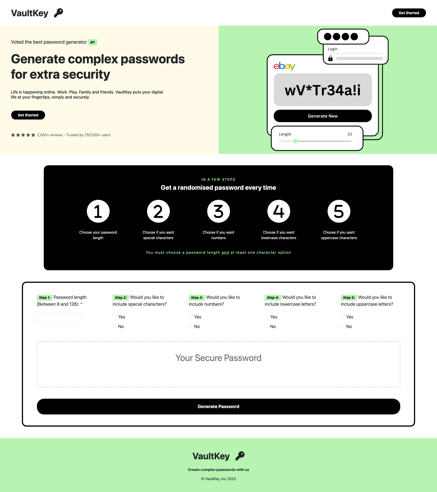

# VaultKey - A Password Generator Application

Building on my last password generator app, see GitHub code [here](https://github.com/LeanneCodes/password-generator) and live project [here](https://leannecodes.github.io/password-generator/), I wanted to improve on the user interface and make it look like a real-world application.

The app provides step-by-step instructions for users, starting with guidance on navigating its features. Users are prompted to set a password length, ranging from 8 to 128 characters, and to select the specific types of characters they want to include. Upon clicking "Generate Password," a unique character string is generated on the screen, ready for users to copy and utilise for personal or professional purposes.

I want to give credit to Mahima Mahajan for her Dribbble design [here](https://dribbble.com/shots/20288725-MyPass-Password-Manager), where I replicated her header design using HTML, CSS and then Canva for the hero image.

## Application Appearance

View live project [here](https://leannecodes.github.io/vault-key-generator/)

## Future Implementations
- I would add a copy icon, that when you click it, it stores the most recent password string to the user's clipboard.

## Credits
- Mahima Mahajan for her Dribbble design [here](https://dribbble.com/shots/20288725-MyPass-Password-Manager)
- FontAwesome for the icons
- Bootstrap CDN
